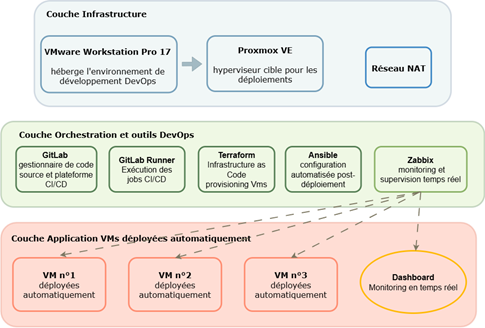

# 🚀 Pipeline CI/CD — Déploiement automatisé de VMs et supervision Zabbix

> Projet DevOps — Infrastructure as Code complète avec pipeline GitLab CI/CD, provisioning Terraform, configuration Ansible et supervision temps réel Zabbix.


---

## 📋 Table des matières

- [Vue d'ensemble](#vue-densemble)
- [Architecture globale](#architecture-globale)
- [Stack technique](#stack-technique)
- [Pipeline CI/CD](#pipeline-cicd)
- [Infrastructure as Code : Terraform](#infrastructure-as-code--terraform)
- [Configuration automatisée : Ansible](#configuration-automatisée--ansible)
- [Supervision : Zabbix](#supervision--zabbix)
- [Structure du dépôt](#structure-du-dépôt)
- [Points clés DevOps](#points-clés-devops)

---

## Vue d'ensemble

Ce projet implémente un **pipeline CI/CD bout-en-bout** capable de :

1. **Provisionner automatiquement** des VMs Debian 12 sur Proxmox VE via Terraform
2. **Configurer les VMs** (utilisateurs, Docker, stack web Nginx) via des rôles Ansible
3. **Déployer les agents de supervision** Zabbix Agent 2 avec auto-registration
4. **Superviser en temps réel** l'ensemble du parc via un dashboard Zabbix

L'ensemble du cycle, du déclenchement du pipeline au monitoring opérationnel est **entièrement automatisé**, sans intervention manuelle.

---

## Architecture globale



## Stack technique

| Domaine | Technologie | Rôle |
|---|---|---|
| Hyperviseur | Proxmox VE | Hébergement des VMs cibles |
| IaC | Terraform + provider `bpg/proxmox` | Provisioning des VMs via API |
| Configuration | Ansible (rôles) | Post-déploiement : users, Docker, web, Zabbix |
| CI/CD | GitLab + GitLab Runner | Orchestration du pipeline complet |
| Conteneurisation | Docker + Nginx Alpine | Déploiement de la stack web |
| Supervision | Zabbix 7.x + Agent 2 | Monitoring temps réel, auto-registration |
| OS cible | Debian 12 (Bookworm) | Toutes les VMs déployées |
| Template VM | Cloud-Init (qcow2) | Image de base pour le clonage Terraform |

---

## Pipeline CI/CD

Le pipeline GitLab CI/CD est découpé en **6 stages séquentiels** :


| Stage | Description |
|---|---|
| `precheck` | Vérification de la connectivité SSH vers Terraform et Ansible |
| `terraform_validation` | `terraform init` + `terraform validate` |
| `terraform_plan` | Génération et revue du plan d'exécution |
| `terraform_apply` | Provisioning réel des VMs sur Proxmox |
| `ansible_sync` | Synchronisation des playbooks vers la VM Ansible |
| `ansible_apply` | Exécution des rôles (users → docker → web → zabbix) |

**Sécurité du pipeline :**
- Les secrets (token Proxmox, clés SSH) sont stockés comme **variables CI/CD GitLab chiffrées**, jamais en clair dans le code
- La clé SSH est injectée en base64 (`SSH_PRIVATE_KEY_B64`) et décodée uniquement au runtime

---

## Infrastructure as Code : Terraform

Terraform provisionne chaque VM en clonant un **template Cloud-Init Debian 12** pré-configuré dans Proxmox.

**Ce que Terraform gère :**
- Clonage complet du template (`full clone`)
- Attribution des ressources (vCPU, RAM, stockage)
- Configuration réseau via Cloud-Init
- Authentification via **token API Proxmox** (principe du moindre privilège avec rôle `TerraformProvisioner`)

**Rôle Proxmox dédié** avec permissions minimales :
```
Datastore.AllocateSpace | Datastore.Audit | VM.Allocate | VM.Clone
VM.Config.* | VM.PowerMgmt | SDN.Use | Sys.Audit
```

---

## Configuration automatisée : Ansible

Une fois les VMs provisionnées, Ansible prend le relais avec **4 rôles organisés** :

```
site.yml
├── role: users      → Création des comptes, clés SSH, sudoers
├── role: docker     → Installation Docker Engine (via geerlingguy.docker)
├── role: web        → Déploiement Nginx dans un conteneur Docker
└── role: zabbix     → Installation et configuration Zabbix Agent 2
```

**Inventaire dynamique :** les VMs déployées par Terraform sont automatiquement ciblées par Ansible (groupe `srv_debian`).

**Idempotence garantie** sur tous les rôles. Le playbook peut être relancer sans effet de bord.

### Rôle `web`
- Déploie une page de statut via un conteneur **Nginx Alpine**
- Contenu généré dynamiquement par template **Jinja2** (hostname, date de déploiement)
- Libère le port 80 si Nginx système est présent

### Rôle `zabbix`
- Installe **Zabbix Agent 2** depuis le dépôt officiel
- Configure les **active checks** vers le serveur Zabbix
- Définit la métadonnée `DEVOPS_CI` pour l'**auto-registration** côté serveur
- Ajoute l'agent au groupe `docker` si disponible (monitoring des conteneurs)

---

## Supervision : Zabbix

### Auto-registration des hôtes
Les VMs déployées par le pipeline s'enregistrent **automatiquement** dans Zabbix sans configuration manuelle :

```
VM déployée
  └─▶ Zabbix Agent 2 démarré (rôle Ansible)
        └─▶ Envoi de HostMetadata = "DEVOPS_CI"
              └─▶ Action Zabbix : "si metadata CONTAINS DEVOPS_CI → ajouter l'hôte"
                    └─▶ Hôte visible dans le dashboard Zabbix ✅
```

### Configuration Agent 2
- **Mode actif** : l'agent pousse les données vers le serveur (port 10051)
- **Buffer persistant désactivé** : adapté à un environnement lab/CI
- **TLS** : configurable (none / PSK) via variable Ansible

---

## Structure du dépôt

```
.
├── .gitlab-ci.yml              # Pipeline CI/CD principal
├── ci/
│   └── variables.yml           # Variables d'environnement CI (hosts, dirs)
│
├── terraform/
│   ├── main.tf                 # Ressource VM Proxmox
│   └── variables.tf            # Variables d'entrée (sans valeurs sensibles)
│
└── ansible/
    ├── site.yml                # Playbook principal
    ├── hosts                   # Inventaire des VMs cibles
    ├── requirements.yml        # Dépendances Galaxy (geerlingguy.docker)
    └── roles/
        ├── users/              # Gestion des utilisateurs et SSH
        ├── docker/             # Installation Docker Engine
        ├── web/                # Stack Nginx conteneurisée
        └── zabbix/             # Zabbix Agent 2 + auto-registration
```

---

## Points clés DevOps

- **Infrastructure as Code complète** : chaque composant est versionné et reproductible
- **Pipeline bout-en-bout** : du commit Git au service supervisé, sans intervention manuelle
- **Séparation des secrets** : aucune credential en dur dans le code, variables CI/CD chiffrées
- **Idempotence Ansible** : les rôles peuvent être rejoués en toute sécurité
- **Supervision intégrée au déploiement** : les agents Zabbix font partie du pipeline, pas une étape post-hoc
- **Principe du moindre privilège** : rôle Proxmox dédié avec permissions minimales pour Terraform

---

*Projet personnel, stack 100% open source.*

## Me contacter

[LinkedIn](https://www.linkedin.com/in/layillaIs)
