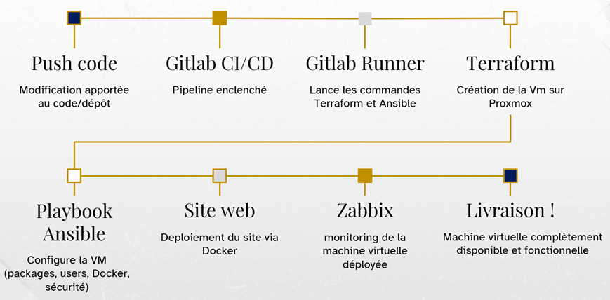
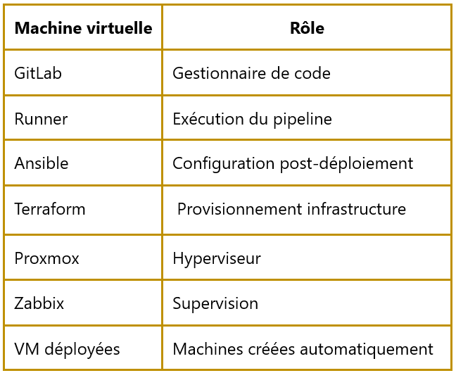

# 01 — Infrastructure

## Vue d'ensemble

L'infrastructure DevOps mise en place repose sur une architecture distribuée de machines virtuelles organisées en **3 couches distinctes** :

- Une couche **hôte** (VMware Workstation Pro 17) hébergeant l'ensemble de l'environnement de laboratoire
- Une couche **orchestration** regroupant tous les outils DevOps
- Une couche **application** constituée des VMs déployées automatiquement par le pipeline

---

## Architecture globale

---

## Workflow de déploiement

---

## Stack technique

| Couche | Composant | Justification principale |
|---|---|---|
| Hyperviseur hôte | VMware Workstation 17 | Virtualisation imbriquée |
| Hyperviseur prod | Proxmox VE | Open source, API REST, gratuit |
| CI/CD | GitLab CE | Solution intégrée, YAML |
| Exécution jobs | GitLab Runner SSH | Simplicité, sécurité, traçabilité |
| Provisioning | Terraform | State management, déclaratif, provider Proxmox |
| Configuration | Ansible | Idempotent, syntaxe YAML |
| Conteneurisation | Docker | Isolation, reproductibilité, Docker Hub |
| Monitoring | Zabbix | Tout-en-un, auto-registration, templates |
| OS cible | Debian 12 | Stabilité, compatibilité, léger |

> Stack 100% open source, choisie pour sa compatibilité CI/CD native et sa capacité à scripter, automatiser et standardiser les déploiements.

---

## Composants de l'infrastructure

### VMware Workstation Pro 17 : Hyperviseur hôte

VMware Workstation Pro 17 constitue l'hyperviseur hôte hébergeant l'intégralité de l'environnement. Il a été retenu pour sa capacité à supporter la **virtualisation imbriquée**, permettant d'exécuter Proxmox VE comme machine virtuelle à l'intérieur de VMware ce qui permet de reproduire un environnement de laboratoire complet sans serveur physique dédié.

Atouts clés pour ce projet :
- Support matériel Intel VT-x/AMD-V pour les ressources CPU et RAM
- Réseau flexible : configuration NAT isolant le réseau tout en conservant l'accès Internet
- Snapshots pour les points de restauration en cas d'erreur

---

### Proxmox VE : Hyperviseur cible

Proxmox VE est l'hyperviseur recevant les machines virtuelles déployées automatiquement par Terraform. Il a été choisi comme plateforme de virtualisation pour les raisons suivantes :

- **Open source et gratuit** : basé sur Debian, distribué sous licence AGPL
- **API REST complète** : interface programmable permettant l'intégration native avec Terraform via le provider `bpg/proxmox`
- **Interface web moderne** : console accessible via navigateur facilitant la gestion et le monitoring
- **Basé sur Debian** : stack Linux stable et bien connue, facilitant l'administration système

L'intégration Terraform se fait via des appels HTTP authentifiés par **token API**, permettant de provisionner des VMs de manière programmé. Un template Debian 12 (Cloud-Init) pré-configuré dans Proxmox sert de base de clonage, accélérant la création des machines.

---

### Réseau

L'ensemble des machines virtuelles communiquent sur un **réseau dédié isolé**. Chaque VM dispose d'une adresse IP fixe attribuée selon son rôle, calculée automatiquement par Terraform à partir du VMID.

> ⚠️ Environnement de laboratoire interne, les adresses IP ne sont pas publiées.

---

### Template Cloud-Init — Base de clonage

Chaque VM déployée par le pipeline est créée par clonage d'un **template Debian 12 Cloud-Init** pré-configuré dans Proxmox. Ce template intègre :

- L'image officielle Debian 12 Generic (`debian-12-generic-amd64.qcow2`)
- L'agent QEMU (`qemu-guest-agent`) pour la communication avec l'API Proxmox
- La clé SSH publique Ansible pour l'accès sans mot de passe
- La configuration réseau initiale en DHCP (l'IP statique est appliquée en post-déploiement par Terraform via l'API Proxmox)

---

## Ce que chaque VM déployée contient

Une fois le pipeline exécuté, chaque VM provisionnée héberge automatiquement :

- Un **utilisateur système** configuré avec clé SSH et droits sudo (rôle Ansible `users`)
- **Docker Engine** installé et démarré (rôle Ansible `docker`)
- Un **conteneur Nginx Alpine** exposant une page de statut sur le port 80 (rôle Ansible `web`)
- Un **Zabbix Agent 2** configuré en mode actif, enregistré automatiquement dans le serveur Zabbix (rôle Ansible `zabbix`)
