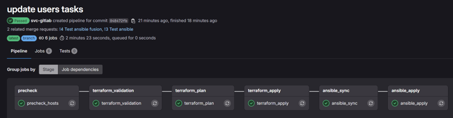
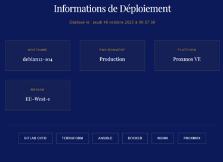

# 02 — Pipeline CI/CD

## Vue d'ensemble

Le pipeline GitLab CI/CD est le cœur du projet. Il orchestre l'ensemble du cycle de déploiement, de la validation du code à la machine virtuelle opérationnelle en **6 stages séquentiels entièrement automatisés**.

Chaque stage doit se terminer avec succès avant que le suivant ne démarre. En cas d'erreur à n'importe quelle étape, le pipeline s'arrête immédiatement, empêchant la propagation d'une configuration défaillante.

---

## Pipeline en action


---

## Les 6 stages

### Stage 0 : `precheck`

Avant tout déploiement, le runner vérifie la connectivité SSH vers les VMs Terraform et Ansible, ainsi que leur accessibilité réseau (ping). Ce stage **prévient les échecs en aval** dus à un problème réseau ou SSH.

```yaml
precheck_hosts:
  stage: precheck
  script:
    - ssh -o BatchMode=yes -i ~/.ssh/gitlab-ci "$TF_USER@$TF_HOST" 'echo OK TF'
    - ssh -o BatchMode=yes -i ~/.ssh/gitlab-ci "$ANS_USER@$ANS_HOST" 'echo OK ANS'
    - ping -c1 -W2 "$TF_HOST"  || true
    - ping -c1 -W2 "$ANS_HOST" || true
```

---

### Stage 1 : `terraform_validation`

Les fichiers Terraform sont copiés vers la VM Terraform via SCP, puis `terraform init` et `terraform validate` sont exécutés à distance. Ce stage **garantit la syntaxe HCL** avant tout plan ou apply.

```yaml
terraform_validation:
  stage: terraform_validation
  script:
    - scp -i ~/.ssh/gitlab-ci -r ./terraform/. "$TF_USER@$TF_HOST:$TF_DIR/"
    - ssh ... "terraform init -no-color && terraform validate -no-color"
```

---

### Stage 2 : `terraform_plan`

Terraform génère un **plan d'exécution détaillé** (`tfplan`) qui liste exactement ce qui sera créé, modifié ou détruit. Ce plan est sauvegardé comme **artifact GitLab** (conservé 1 heure) pour être réutilisé à l'étape suivante.

Un workspace CI dédié (`ci-<pipeline_id>`) est créé à chaque pipeline pour isoler les exécutions concurrentes.

```yaml
terraform_plan:
  stage: terraform_plan
  script:
    - terraform workspace new "ci-${CI_PIPELINE_ID}"
    - terraform plan -no-color -out=tfplan
```

---

### Stage 3 : `terraform_apply`

C'est l'étape de **provisioning réel** : Terraform applique le plan pour créer la VM sur Proxmox via l'API REST. Une fois la VM créée, ses informations (`VM_IP`, `VM_NAME`) sont exportées dans un fichier `tf.env` transmis comme **dotenv artifact** aux stages suivants.

```yaml
terraform_apply:
  stage: terraform_apply
  script:
    - terraform apply -auto-approve -no-color "tfplan"
    - terraform output -raw vm_ipv4 > tf.env
  artifacts:
    reports:
      dotenv: tf.env   # VM_IP et VM_NAME disponibles pour Ansible
```

---

### Stage 4 : `ansible_sync`

Le contenu du dossier `ansible/` du dépôt GitLab est **synchronisé vers la VM Ansible** via SSH/tar. Ce stage assure que la VM Ansible dispose toujours de la version la plus récente des playbooks et rôles avant de les exécuter.

```yaml
ansible_sync:
  stage: ansible_sync
  needs: ["terraform_apply"]
  script:
    - tar -C ansible -cf - . | ssh ... "tar -C ~/ansible/projet/ansible -xf -"
```

---

### Stage 5 : `ansible_apply`

Le stage final lance le playbook Ansible sur la VM nouvellement créée. Ansible attend d'abord que le port SSH soit accessible (jusqu'à 5 minutes), installe les dépendances Galaxy, puis exécute les **4 rôles** dans l'ordre :

```
users → docker → web → zabbix
```

Le mot de passe `become` est injecté via un fichier temporaire chiffré, supprimé par `shred` après exécution.

```yaml
ansible_apply:
  stage: ansible_apply
  needs: ["terraform_apply", "ansible_sync"]
  script:
    - # Attend l'ouverture du port 22 (jusqu'à ~5 min)
    - ansible-galaxy install -r requirements.yml --force
    - ansible-playbook site.yml --limit "${VM_NAME}" -b
    - shred -u /tmp/ci_vars_*.yml  # nettoyage des secrets
```

---

## Gestion des secrets

Aucune credential n'est stockée en clair dans le code. Tous les secrets transitent via les **variables CI/CD GitLab chiffrées**, masquées dans les logs :

| Variable | Contenu | Usage |
|---|---|---|
| `SSH_PRIVATE_KEY_B64` | Clé SSH privée en base64 | Accès aux VMs depuis le runner |
| `TFVARS_API_B64` | Variables Terraform en base64 | Token API Proxmox |
| `SUDO_PASSWORD` | Mot de passe become Ansible | Exécution des tâches root |

La clé SSH est décodée uniquement au runtime dans `~/.ssh/gitlab-ci` et n'est jamais persistée sur disque entre les jobs.

---

## Passage des données entre stages

Un mécanisme clé du pipeline est le passage de l'IP et du nom de la VM créée par Terraform vers Ansible, via les **dotenv artifacts** GitLab :

```
terraform_apply
    └─▶ écrit tf.env (VM_IP=x.x.x.x, VM_NAME=debian12-xxx)
            └─▶ ansible_apply lit VM_IP et VM_NAME
                    └─▶ ansible-playbook --limit ${VM_NAME}
```

---

## Résultat final

Une fois le pipeline complété avec succès, la VM déployée expose une **page de statut** générée dynamiquement par le template Jinja2 Ansible :





> La page affiche le hostname, la date de déploiement, la plateforme (Proxmox VE) et la stack utilisée, preuve que l'ensemble de la chaîne CI/CD a fonctionné de bout en bout.

---

## Ce que ce pipeline démontre

- **Traçabilité complète** : chaque déploiement est lié à un commit Git, un pipeline ID, et un workspace Terraform isolé
- **Fail-fast** : l'arrêt immédiat en cas d'erreur empêche tout déploiement partiel
- **Séparation des responsabilités** : Terraform gère l'infra, Ansible gère la configuration
- **Reproductibilité** : le même pipeline rejoué produit le même résultat, garanti par l'idempotence Ansible
- **Sécurité by design** : aucun secret en clair, nettoyage des fichiers sensibles après usage
