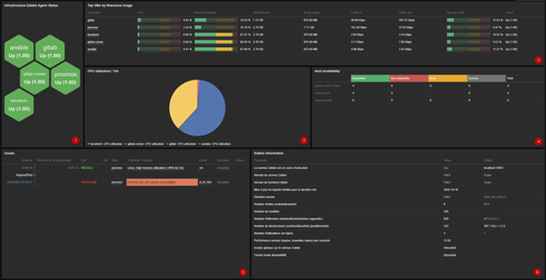
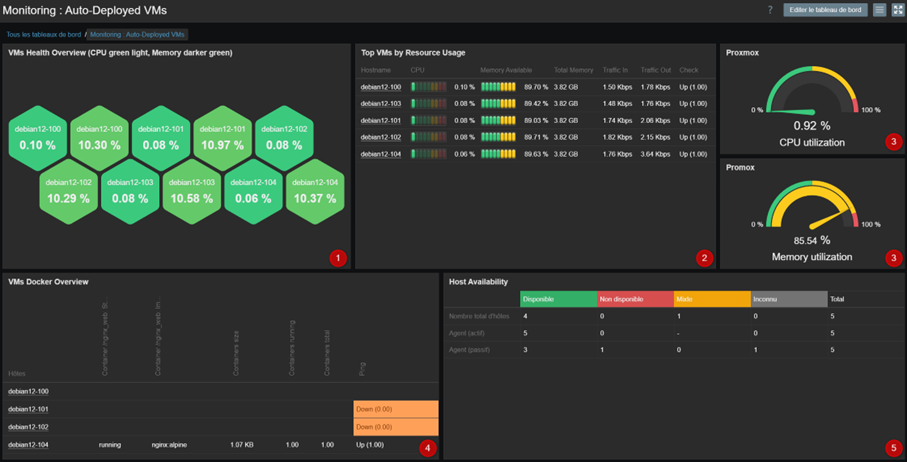

# 05 — Supervision Zabbix

## Vue d'ensemble

Zabbix est l'outil de **supervision et monitoring temps réel** du projet. Il est déployé comme un composant à part entière du pipeline — pas comme une couche ajoutée après coup — ce qui garantit que chaque VM est supervisée dès sa mise en service.

L'architecture retenue repose sur **Zabbix Agent 2** en mode actif avec **auto-registration**, permettant aux VMs de s'enregistrer automatiquement dans le serveur Zabbix sans aucune intervention manuelle.

## Auto-registration : Le mécanisme clé

L'**auto-registration** est la fonctionnalité centrale : chaque VM déployée par le pipeline s'enregistre automatiquement dans Zabbix sans configuration manuelle côté serveur.

### Fonctionnement

```
1. Ansible déploie Zabbix Agent 2 sur la VM
         │
         ▼
2. L'agent démarre et envoie une requête active vers le serveur Zabbix
   avec la métadonnée : HostMetadata=DEVOPS_CI
         │
         ▼
3. Le serveur Zabbix évalue l'action d'auto-registration :
   "SI HostMetadata CONTAINS 'DEVOPS_CI'"
         │
         ▼
4. L'hôte est automatiquement :
   - Ajouté à l'inventaire Zabbix
   - Lié au template de supervision approprié
   - Rattaché au groupe "CI-DevOps"
         │
         ▼
5. La VM est visible dans le dashboard
   (CPU, mémoire, réseau, Docker — sans aucune action manuelle)
```

### Configuration Agent 2 (générée par Ansible)

```ini
### Managed by Ansible ###
Server=<zabbix_server>
ServerActive=<zabbix_server>:10051
ListenPort=10050

# Nom de l'hôte dans Zabbix = nom Ansible (déterministe)
Hostname={{ inventory_hostname }}

# Clé d'auto-registration
HostMetadata=DEVOPS_CI

EnablePersistentBuffer=0
Include=/etc/zabbix/zabbix_agent2.d/*.conf
```

> Le `Hostname` est dérivé de `inventory_hostname` Ansible, lui-même basé sur le nom de la VM Terraform (`debian12-<vmid>`). La chaîne Terraform → Ansible → Zabbix est donc entièrement **traçable et déterministe**.

---

## Dashboard : Supervision de l'infrastructure

Le premier dashboard surveille les **VMs de l'infrastructure DevOps** (GitLab, Runner, Ansible, Terraform, Proxmox) :



Ce qu'il affiche :
- **État des agents** Zabbix sur chaque machine (Up/Down)
- **Top VMs par usage ressources** : CPU, mémoire, swap, trafic réseau, stockage
- **Répartition CPU** entre les différentes VMs (camembert)
- **Disponibilité des hôtes** : nombre d'hôtes actifs, agents actifs/passifs
- **Problèmes actifs** remontés automatiquement (ex : erreur API Proxmox)
- **Informations serveur Zabbix** : version, nombre d'hôtes suivis, éléments actifs

---

## Dashboard : Supervision des VMs déployées

Le second dashboard est dédié aux **VMs déployées automatiquement** par le pipeline CI/CD :



Ce qu'il affiche :
- **Vue hexagonale des VMs** : chaque hexagone représente une VM, la couleur indique l'état (vert = OK), la valeur = charge CPU actuelle
- **Top VMs par usage ressources** : CPU, mémoire disponible, trafic réseau par VM
- **Jauges Proxmox** : utilisation CPU et mémoire de l'hyperviseur lui-même
- **VMs Docker Overview** : état des conteneurs détectés sur chaque VM (image, statut, ports)
- **Host Availability** : résumé du statut de tous les agents (disponible / non disponible / inconnu)

> Le suivi Docker est entièrement automatique : dès qu'une VM est déployée et qu'un conteneur y tourne, Zabbix le découvre et l'ajoute au tableau sans aucune intervention — grâce à l'ajout de l'utilisateur `zabbix` dans le groupe `docker` par le rôle Ansible.

---

## Zabbix Agent 2 : Pourquoi Agent 2 ?

| Critère | Agent 1 | Agent 2 |
|---|---|---|
| Plugins natifs | Limités | Nombreux (Docker, MongoDB, PostgreSQL...) |
| Monitoring Docker | Non natif | ✅ Natif via plugin |
| Performance | Standard | Meilleure (goroutines) |
| Configuration | Fichier unique | Fichier principal + `*.conf` inclus |
| Go / Concurrent | Non | ✅ Oui |

Agent 2 a été choisi pour sa capacité native à monitorer les **conteneurs Docker** sans plugin externe, ce qui est cohérent avec l'architecture du projet.

---

## Mode actif vs passif

Le projet utilise le **mode actif** pour les checks Zabbix :

```
Mode passif (défaut)          Mode actif (choisi)
─────────────────────         ─────────────────────
Serveur → interroge Agent     Agent → pousse vers Serveur
Port 10050 entrant requis     Port 10051 sortant uniquement
Nécessite accès réseau        Plus adapté en environnement
depuis le serveur             cloisonné / CI/CD
```

En mode actif, l'agent initie la connexion vers le serveur sur le port 10051. Cela simplifie les règles de pare-feu et est mieux adapté à des VMs déployées dynamiquement dont l'IP varie.

---

## Ce que cette supervision démontre

- **Supervision proactive** : les VMs sont monitorées dès leur création, pas après
- **Auto-registration** : zéro configuration manuelle côté serveur Zabbix
- **Intégration pipeline** : Zabbix Agent 2 est un rôle Ansible parmi les autres, versionné dans Git
- **Monitoring Docker natif** : les conteneurs sont découverts et suivis automatiquement
- **Traçabilité** : le nom de l'hôte Zabbix correspond exactement au nom Terraform et Ansible
- **Maîtrise exploitation/configuration** : installation depuis dépôt officiel, configuration via template Jinja2, gestion des ports UFW, choix du mode actif/passif
