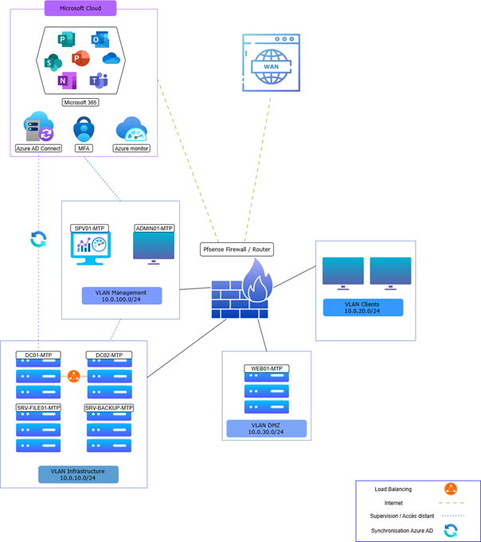

# Architecture

## Contexte de départ

ApexTech Solutions opérait sur une infrastructure AD on-premise classique :
un seul contrôleur de domaine, pas de redondance, pas de MFA, aucune 
mobilité cloud pour les utilisateurs.

## Architecture cible

L'objectif : une architecture hybride permettant de conserver la gestion 
des identités on-premise tout en ouvrant les services cloud Microsoft 365 
aux utilisateurs, avec un niveau de sécurité renforcé.

> Schéma de l'architecture cible  

## Infrastructure déployée

**On-premise (VMware)**

| Serveur | Rôle |
|---|---|
| DC01-MTP | Contrôleur de domaine principal (AD DS, DNS, DHCP) |
| DC02-MTP | Contrôleur de domaine secondaire (haute disponibilité) |
| SRV-FILES | Serveur de fichiers (partages SMB) |
| SRV-BACKUP | Serveur de sauvegarde (Veeam) |
| pfSense | Pare-feu + segmentation VLAN |

**Réseau**

4 VLANs segmentés : Administration, Serveurs, Utilisateurs, DMZ

**Cloud (Azure)**

- Tenant Microsoft Entra ID
- Azure AD Connect (synchronisation hybride)
- Microsoft 365 Business Premium
- Azure Backup

## Approche retenue

Migration progressive (par phases) plutôt qu'un basculement Big Bang, 
pour garantir la continuité de service à chaque étape.

## Sécurité by design

Toute l'architecture a été pensée avec la baseline ANSSI comme référence :
segmentation réseau, moindre privilège, durcissement des GPO, MFA 
obligatoire et accès conditionnel dès la conception.